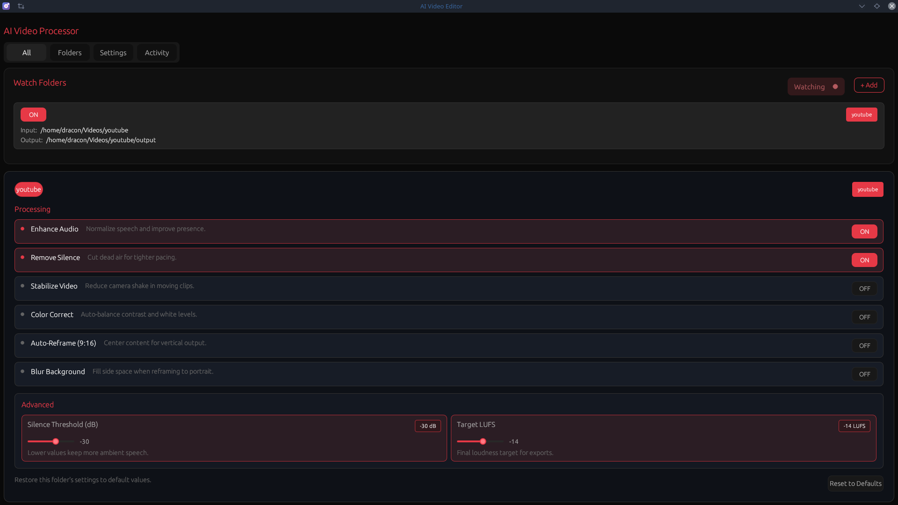

# AI Video Editor

A command-line and GUI tool for automated video editing using AI. Designed for content creators who want to drop in raw footage and get polished results without manual editing.



## Quick Start

**GUI** (default when launched from desktop):
```bash
cargo run
```

**CLI** (from terminal with arguments):
```bash
cargo run --release -- -i input.mp4 -o output.mp4 --preset youtube
```

**Using just:**
```bash
just gui      # Run GUI explicitly
just build    # Build release
just test     # Run tests
```

## Installation

### From Source

```bash
git clone https://github.com/DraconDev/ai-vid-editor.git
cd ai-vid-editor
./install.sh --user    # Install to ~/.local/bin (no sudo)
# or
sudo ./install.sh      # Install to /usr/local/bin
```

The install script will:
- Build and install the binary
- Install the application icon and desktop entry (shows in app menu)
- Optionally set up a systemd service for daemon mode

### Releases & Distribution

- Run `scripts/release.sh <version>` after tests to build, bundle, and checksum `release/ai-vid-editor-<version>.tar.gz`. The script already copies the binary, installer, desktop assets, and docs into the release directory.
- Publish the generated artifacts plus any AppImage/DEB/RPM/Flatpak/Snap packages to GitHub Releases or your download site, then update `docs/release-locations.md` (and link from `docs/linux-release-guide.md`) so casual Linux users know where to download and how to install.
- Point readers to `docs/linux-release-guide.md` for packaging options and `docs/customer-facing.md` for the onboarding story, so both builders and end users understand the experience.

### Requirements

- [Rust](https://rustup.rs/) (edition 2024)
- [FFmpeg](https://ffmpeg.org/) (for video processing)

### NixOS

```bash
nix-shell  # or: nix develop
```

## Usage

### GUI Mode

Launch without arguments from desktop or run:
```bash
ai-vid-editor
ai-vid-editor --gui    # Explicit
```

The GUI provides a visual interface for managing watch folders and settings.

### CLI Mode

```bash
# Basic silence removal
ai-vid-editor -i input.mp4 -o output.mp4

# YouTube preset (cut silences + enhance + chapters)
ai-vid-editor -i input.mp4 -o output.mp4 --preset youtube

# Full production pipeline
ai-vid-editor -i input.mp4 -o output.mp4 \
  --preset youtube \
  --intro intro.mp4 \
  --outro outro.mp4 \
  --music-dir ./music \
  --stabilize \
  --color-correct

# Batch process a directory
ai-vid-editor -I ./raw_videos -O ./edited --preset youtube

# Watch folder (auto-process new videos)
ai-vid-editor --watch ./incoming -O ./processed --notify

# Watch using config (reads paths.watch_folders, no flags needed)
ai-vid-editor

# Preview without processing
ai-vid-editor -i input.mp4 --dry-run
```

### GUI Mode

```bash
ai-vid-editor --gui
```

The GUI provides a visual interface for managing watch folders and settings.

## CLI Options

| Flag | Description |
|------|-------------|
| `-i, --input-file <FILE>` | Input video file |
| `-I, --input-dir <DIR>` | Input directory (batch mode) |
| `-o, --output-file <FILE>` | Output video file |
| `-O, --output-dir <DIR>` | Output directory (batch mode) |
| `-P, --preset <PRESET>` | Preset: `youtube`, `shorts`, `podcast`, `minimal` |
| `-c, --config <FILE>` | Path to TOML config file |
| `--gui` | Launch graphical interface |
| `--notify` | Send desktop notifications |
| `-w, --watch <DIR>` | Watch folder for new videos |
| `-n, --dry-run` | Preview without processing |
| `-j, --json` | JSON output for scripting |
| `--generate-config` | Output sample config |

### Processing Options

| Flag | Description |
|------|-------------|
| `-t, --threshold <dB>` | Silence threshold (default: -30.0) |
| `-d, --duration <SEC>` | Min silence duration (default: 0.5) |
| `-p, --padding <SEC>` | Padding around cuts (default: 0.1) |
| `-s, --speedup` | Speed up silences instead of cutting |
| `-E, --enhance` | Enable audio enhancement |
| `--noise-reduction` | Enable noise reduction |
| `-m, --music <FILE>` | Background music file |
| `--music-dir <DIR>` | Music folder (picks random track) |
| `--intro <FILE>` | Video to prepend |
| `--outro <FILE>` | Video to append |
| `--stabilize` | Enable video stabilization |
| `--color-correct` | Enable auto color correction |
| `--reframe` | Auto-reframe to vertical (9:16) |
| `--blur-background` | Blur background behind speaker |
| `--remove-fillers` | Remove filler words (um, uh, etc.) |

### Export Options

| Flag | Description |
|------|-------------|
| `--export-srt` | Generate SRT subtitles (Whisper transcription) |
| `--export-captions` | Burn styled subtitles into video |
| `--export-chapters` | Generate YouTube chapters (from Whisper) |
| `--export-clips` | Extract highlight clips for Shorts/Reels |
| `--export-fcpxml` | Generate FCPXML |
| `--export-edl` | Generate EDL |

## Presets

| Preset | Description |
|--------|-------------|
| `youtube` | Cut silences, enhance audio (two-pass loudnorm + gentle EQ), export chapters + FCPXML |
| `shorts` | Speedup silences (3x), enhance audio, extract highlight clips |
| `podcast` | Cut silences, enhance audio (-16 LUFS), export SRT + styled captions |
| `minimal` | Just silence detection, no enhancement |

## Configuration

Create `ai-vid-editor.toml` in your project directory or `~/.config/ai-vid-editor/config.toml`:

Config from `~/.config/ai-vid-editor/config.toml` is loaded automatically — no `--config` flag needed.

```toml
[paths]
input_dir = "watch"
output_dir = "output"
music_dir = "music"

# Watch folders (also used by GUI). CLI reads these automatically.
[[paths.watch_folders]]
input = "/home/user/Videos/youtube"
output = "/home/user/Videos/youtube/output"
preset = "youtube"
enabled = true

[silence]
threshold_db = -30.0
min_duration = 0.5
padding = 0.1
mode = "cut"
speedup_factor = 4.0

[filler_words]
enabled = true
words = ["um", "uh", "ah", "er"]
padding = 0.05

[audio]
enhance = true
noise_reduction = false
target_lufs = -14.0
duck_volume = 0.2

[video]
stabilize = false
color_correct = false
reframe = false
blur_background = false

[export]
subtitles = false       # Generate SRT subtitles (Whisper transcription)
chapters = false        # Generate YouTube chapters (from transcript)
fcpxml = false          # Generate Final Cut Pro XML
edl = false             # Generate Edit Decision List
captions = false        # Burn styled subtitles into video
clips = false           # Extract highlight clips for Shorts/Reels
clip_count = 3          # Number of clips to extract
clip_min_duration = 15  # Minimum clip duration (seconds)
clip_max_duration = 60  # Maximum clip duration (seconds)

[watch]
enabled = false
interval = 5
```

### Watch Folders

The `[[paths.watch_folders]]` section works for both CLI and GUI. Drop a video in the configured folder and it gets processed automatically:

```bash
# Uses watch_folders from config — just run:
ai-vid-editor

# Or override with a specific folder:
ai-vid-editor --watch ./incoming -O ./processed
```

Progress is shown with timestamps during processing:
```
[14:30:15] [NEW FILE] "/home/user/Videos/youtube/video.mp4"
[14:30:15] [START] Processing video.mp4...
[14:30:16] [2%] video.mp4 - Analyzing silence
[14:30:25] [10%] video.mp4 - Planning edits
[14:30:25] [15%] video.mp4 - Trimming video
[14:30:45] [78%] video.mp4 - Enhancing audio
[14:30:50] [DONE] video.mp4 -> output/video.mp4 (35.2s)
```

## Build Options

```bash
# Build everything (CLI + GUI) - default
cargo build --release

# Build CLI only (smaller binary, no GUI dependencies)
cargo build --release --no-default-features --features cli

# Build with specific features
cargo build --features cli,gui
```

## Testing

- `cargo test --all-features` exercises config parsing, presets, silence detection, ML helpers, exporters, and CLI/GUI glue. `scripts/release.sh` already runs that plus `cargo clippy --all-features` before packaging each release.
- For localized checks run `cargo test config::tests::test_preset_youtube` or `cargo test --package ai-vid-editor -- ml` to focus the suite on configuration/ML helpers.

## Project Status

| Feature | Status |
|---------|--------|
| Silence detection | Done |
| Silence trimming | Done |
| Speedup mode | Done |
| Batch processing | Done |
| TOML config | Done |
| Audio enhancement | Done |
| Noise reduction | Done |
| Music mixing | Done |
| Intro/Outro | Done |
| Video stabilization | Done |
| Auto color correction | Done |
| Preset profiles | Done |
| Watch mode | Done |
| Dry run | Done |
| JSON output | Done |
| Export formats | Done |
| Whisper STT | Done |
| Filler word removal | Done |
| Auto-reframe | Done |
| Background blur | Done |
| GUI (egui) | Done |
| Desktop notifications | Done |
| Desktop entry / app menu | Done |
| Unified binary (CLI + GUI) | Done |

## License

MIT
